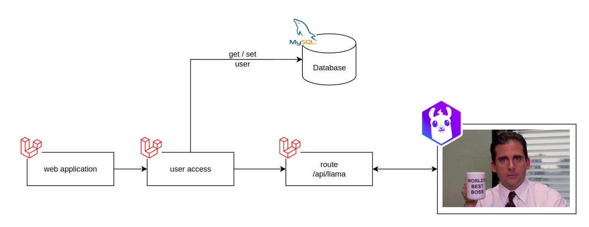

# Talk with Michael Scott

This project, built with Laravel, uses an API to simulate conversations with Michael Scott, the character from The Office, leveraging the Llama 3.1 language model to recreate his iconic lines and interactions.

Technologies Used:
- Laravel
- MySql
- Llama 3.1

> **Autor**: João Pedro Rodrigues Matias | <joaopedrord2001@gmail.com>

## Structure

```bash
├── app                       # Contains the main application code, including Models, Controllers, and Services
│   ├── Http                  # Controllers, Middlewares, and HTTP Requests
│   └── Models                # Eloquent Models
├── config                    # Application configurations (database, mail, cache, etc.)
├── public                    # Public directory where externally accessible files are located
├── resources                 # Resources such as views, assets, and translation files
│   ├── js                    # JavaScript files
│   └── views                 # Laravel Blade views
├── routes                    # Application route files
│   ├── api.php               # API routes
│   └── web.php               # Web routes
├── vendor                    # Composer dependencies
├── .env                      # Environment configuration file
├── artisan                   # Laravel CLI for Artisan commands
├── composer.json             # Project's PHP dependencies
├── package.json              # Project's Node.js dependencies
└── webpack.mix.js            # Laravel Mix configuration for asset compilation
```

## How the "Talk with Michael Scott" Project Works


This project is built with the Laravel framework and uses an API that communicates with the Llama 3.1 language model. It aims to simulate conversations with the character Michael Scott from The Office. When a request is made to the API, the system generates responses in the characteristic style and humor of the character, creating an engaging and entertaining interactive experience.

Below is a step-by-step guide on how to start and configure the Laravel project.

### Instructions for Starting the Laravel Project
Prerequisites
- PHP: Version 8.1 or higher
- Composer: For managing PHP dependencies
- MySQL: Relational database (or another database supported by Laravel)
- Node.js and NPM: For managing frontend dependencies and compiling assets

### Step-by-Step Guide
1. Clone the Project Repository

```bash
git clone https://github.com/JoaoPedroRMatias/talk_with_michael_scott.git
cd talk_with_michael_scott
```

2. Install Laravel Dependencies
```bash
composer install
```

3. Set Up the Database
```bash
php artisan migrate
```

4. Start the Development Server
```bash
php artisan serve
```

The project will be accessible at http://localhost:8000.


